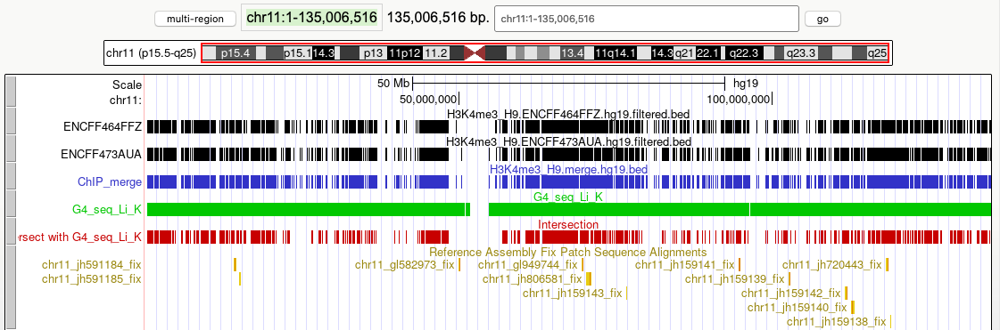

# hse21_H3K4me3_G4_human

UCSC GenomeBrowser session: [link](http://genome.ucsc.edu/s/paguseva/hse21_H3K4me3_G4_human)

Location `chr11:1-135,006,516`

## Location of ChIP-seq peaks

## Location of DNA secondary structures

